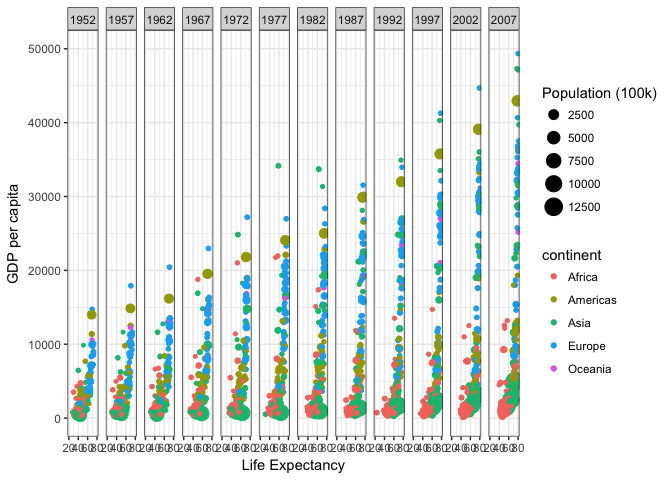
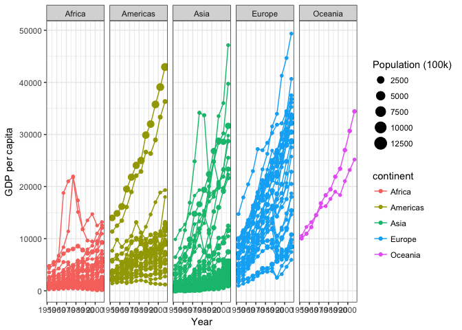

# Case Study 2: Wealth and Life Expectany
Stacy Wilkerson  


##Background

I learned that although ggplot is a very useful way to make visualizations, it has a lot of confusing components. I have also learned that to change a real simple thing or to add something it takes a lot of code and figuring out what function to use and how to use it.    

##Images 

###Plot 1


```r
ggplot(data = gapminder) + 
         geom_point(mapping = aes(x = lifeExp, y = gdpPercap, color = continent, size = pop/100000)) +
        facet_grid(. ~ year) +
        coord_cartesian(xlim = c(20,80), ylim = c(0, 50000)) +
        theme_bw() +
        xlab("Life Expectancy") +
        ylab("GDP per capita") +
        guides(size = guide_legend(title = "Population (100k)")) 
```

<!-- -->

###Plot 2


```r
gapminder1 <- group_by(gapminder, country, year)
gapminder1 <- mutate(gapminder1, meanGDP = weighted.mean(gdpPercap, na.rm = TRUE), meanPOP = weighted.mean(pop, na.rm = TRUE))
gapminder2 <- filter(gapminder1, country != "Kuwait")
```


```r
ggplot(data = gapminder2) + 
         aes(x = year, y = gdpPercap, color = continent) +
         geom_point(mapping = aes(size = pop/100000)) +
         geom_line(mapping = aes(group = (country))) +
         facet_grid(. ~ continent) +
         guides(size = guide_legend(title = "Population (100k)")) +
         theme_bw() +
         xlab("Year") +
         ylab("GDP per capita")
```

<!-- -->


