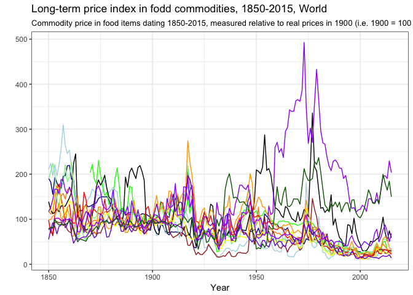
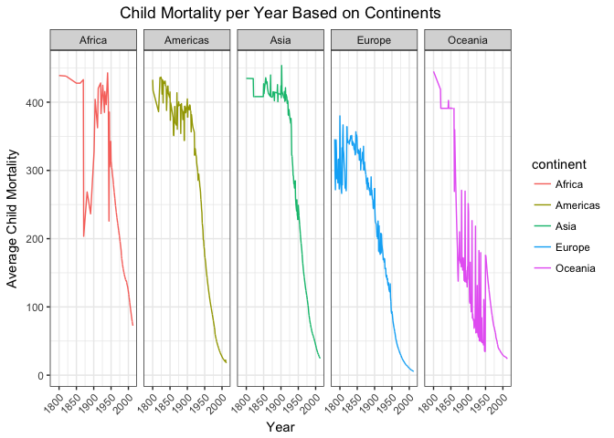

# Task 5: World Data Investigation
Stacy Wilkerson  


The below graph is a graph about the long term prices of certain types of major foods. This graph shows the rise and fall of prices over the years. Although this graph is not an exact replica because of time, but it has gotten pretty close.    


```r
long_term_food %>% 
  ggplot() +
    geom_line(mapping = aes(x = Year, y = Tea), col = "darkblue") +
    geom_line(mapping = aes(x = Year, y = Sugar), col = "lightblue") +
    geom_line(mapping = aes(x = Year, y = Peanuts), col = "green") +
    geom_line(mapping = aes(x = Year, y = Palmoil), col = "darkorange") +
    geom_line(mapping = aes(x = Year, y = Coffee), col = "black") +
    geom_line(mapping = aes(x = Year, y = Cocoa), col = "brown") +
    geom_line(mapping = aes(x = Year, y = Wheat), col = "red") +
    geom_line(mapping = aes(x = Year, y = Rye), col = "lightgreen") +
    geom_line(mapping = aes(x = Year, y = Rice), col = "yellow") +
    geom_line(mapping = aes(x = Year, y = Corn), col = "orange") +
    geom_line(mapping = aes(x = Year, y = Barley), col = "purple1") +
    geom_line(mapping = aes(x = Year, y = Pork), col = "purple3") +
    geom_line(mapping = aes(x = Year, y = Beef), col = "purple") +
    geom_line(mapping = aes(x = Year, y = Lamb), col = "darkgreen") +
    theme_bw() +
    labs(y = "", title = "Long-term price index in fodd commodities, 1850-2015, World", subtitle = "Commodity price in food items dating 1850-2015, measured relative to real prices in 1900 (i.e. 1900 = 100")
```

<!-- -->

The plot below shows child mortality based on the population of countries and separated by continents. The line shows that child mortality has decreased in the past years in all countries. 


```r
child_mortality %>% 
  filter(!is.na(child_mort & population), continent != "NA") %>%
  group_by(continent, year) %>%
  mutate(mean_child_mort = mean(child_mort)) %>% 
  ggplot(aes(x = year, y = mean_child_mort, color = continent)) +
    geom_line() + 
    facet_grid(. ~ continent) +
    theme_bw() +
    theme(axis.text.x = element_text(angle = 45, hjust = 1), plot.title = element_text(hjust = 0.5)) +
    labs(x = "Year", y = "Average Child Mortality", title = "Child Mortality per Year Based on Continents")
```

<!-- -->


