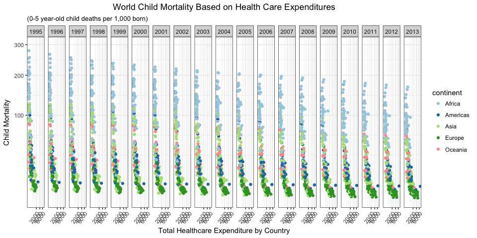

# Task 6: World Data Investigation - Part 2
Stacy Wilkerson  


```r
financing_healthcare %>% 
  filter(!is.na(health_exp_total & child_mort), continent != "NA") %>%
  group_by(year, country) %>%
  ggplot(aes(x = health_exp_total, y = child_mort, color = continent)) +
    geom_point() +
    scale_colour_brewer(palette = "Paired") +
    #In the furture I woud like to do the below, but not right now 
    #geom_label_repel(aes(label = continent), 
    #data = financing_healthcare,
    #size = 6,
    #label.size = 0,
    #segment.color = NA
    #) +
    facet_grid(. ~ year) +
    theme_bw() +
    theme(axis.text.x = element_text(angle = 55, hjust = 1), plot.title = element_text(hjust = 0.5)) +
    labs(x = "Total Healthcare Expenditure by Country", y = "Child Mortality", title = "World Child Mortality Based on Health Care Expenditures", subtitle = "(0-5 year-old child deaths per 1,000 born)") +
    scale_y_continuous(trans = "sqrt") +
    scale_x_continuous(trans = "sqrt") +
    coord_cartesian(ylim = c(1.5, 300), xlim = c(0, 7000))
```

<!-- -->


The above graph is a small snap shot of world child mortality based on total healthcare expenditures, the data that was used came from Our World in Data. As I have gained more knowledge about ggplots it has become a bit easier to implement these new scale to make impactful visualizations. 
