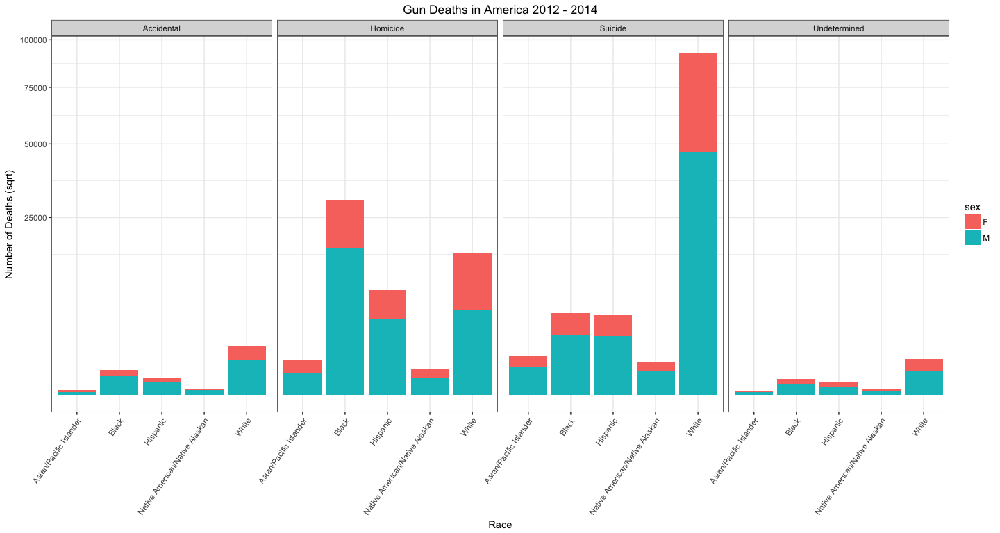
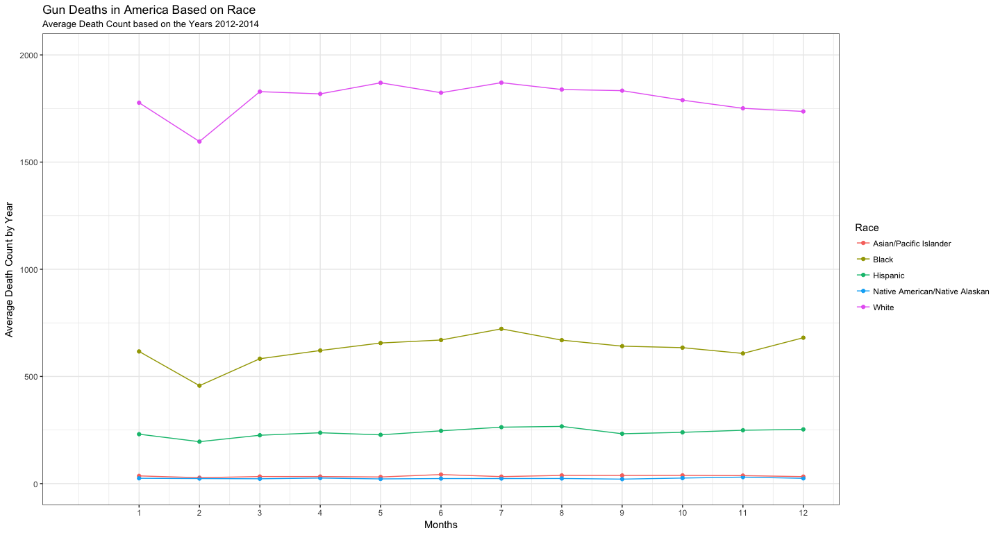
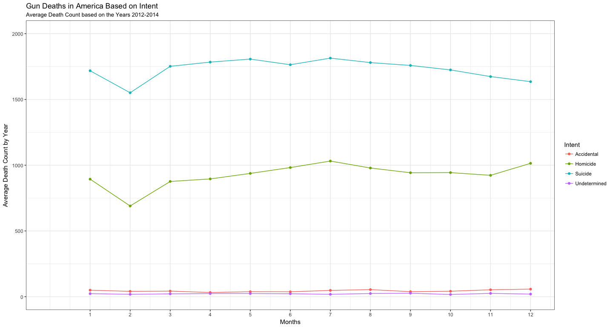

# Case Study 3: Reducing Gun Deaths (FiveThirtyEight)
Stacy Wilkerson  


###Gun Deaths in America Article  


```r
full_data %>% 
  na.omit %>%
  group_by(sex, race) %>%
  ggplot() +
    geom_bar(mapping = aes(x = race, fill = sex)) +
    facet_grid(. ~ intent) +
    theme_bw() +
    theme(axis.text.x = element_text(angle = 55, hjust = 1), plot.title = element_text(hjust = 0.5)) +
    scale_y_continuous(trans = "sqrt") +
    labs(x = "Race", y = "Number of Deaths (sqrt)", title = "Gun Deaths in America 2012 - 2014")
```

<!-- -->

In summarizing this article they used an interactive graph to try to show types of death based on race, intent, and sex. For making a graph that summarizes all of this data a bar graph can be seen above. Although not all of the data can be shown a great deal of this data can be interpreted. It is seen that males have died more due to guns than women. And the most people that have died by gun are whites due to suicide.    

###Gun Deaths in America Graphs Based on Race and then Intenet


```r
full_data %>%
  na.omit %>%
  mutate(count_var = race) %>%
  group_by(count_var, month) %>%
  summarise(count = n()/3) %>%
  ggplot(aes(x = month, y = count)) +
    geom_point(aes(color = count_var)) +
    geom_line(aes(color = count_var)) +
    coord_cartesian(ylim = c(0, 2000), xlim = c(0,12)) +
    theme_bw() +
    scale_x_continuous(breaks = 1:12) + 
     labs(x = "Months", y = "Average Death Count by Year", title = "Gun Deaths in America Based on Race", subtitle = "Average Death Count based on the Years 2012-2014") +
    scale_color_discrete(name = "Race")
```

<!-- -->

This graph shows the average gun death by year based on race. It is seen that in Feburary gun deaths decrease, but then they generally go back up. We can see that based on color Whites have the higher gun death than any other race the second are Blacks.    


```r
full_data %>%
  na.omit %>%
  mutate(count_var = intent) %>%
  group_by(count_var, month) %>%
  summarise(count = n()/3) %>%
  ggplot(aes(x = month, y = count)) +
    geom_point(aes(color = count_var)) +
    geom_line(aes(color = count_var)) +
    coord_cartesian(ylim = c(0, 2000), xlim = c(0,12)) +
    theme_bw() +
    scale_x_continuous(breaks = 1:12) +
    labs(x = "Months", y = "Average Death Count by Year", title = "Gun Deaths in America Based on Intent", subtitle = "Average Death Count based on the Years 2012-2014") +
    scale_color_discrete(name = "Intent")
```

<!-- -->

This graphs shows the average gun death by months based on intent. By looking at the trend lines this graph looks really similar to the graph based on race. It is seen that suicide is the largest reason for gun deaths. In Febuary the average gun death decrease then the steadily increase, but then they decrease again towards the end of the year. 


