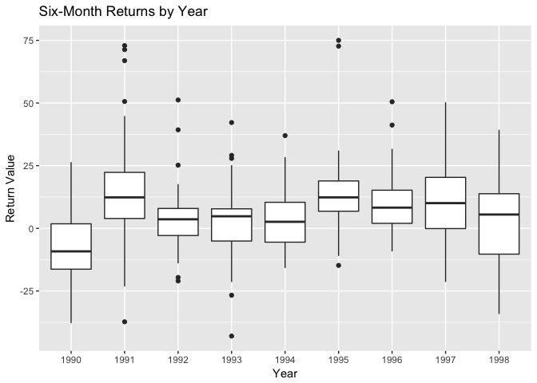

# Task 8: Clean and Reformat (aka tidy)
Stacy Wilkerson  


###Tidy Data

This is code that tidies up the rds data so that we can use this data.


```r
Dart.rds <- read_rds(gzcon(url("https://github.com/byuistats/data/raw/master/Dart_Expert_Dow_6month_anova/Dart_Expert_Dow_6month_anova.RDS")))

tidydata <- Dart.rds %>%
  separate(contest_period, into = c("start", "end"), sep = "-") %>% 
  separate(end, into = c("month_end", "year_end"), sep = -5) %>%
  na.omit

saveRDS(tidydata, "tidydata.rds")
```

###Plot

Below is a boxplot that looks at six-month returns by year. There is a boxplot for each year, so we can look at the average and spread of the changing return values as the years go by. 


```r
tidydata %>% 
  ggplot() +
  geom_boxplot(mapping = aes(x = year_end, y = value)) + 
  labs(x = "Year", y = "Return Value", title = "Six-Month Returns by Year")
```

<!-- -->

###Table

Below is a table that shows the end months on the rows and the end years in the columns. So each cell has the return value based on the end month and year that correspond to the value. 


```r
DJIAdata <- tidydata %>%
  filter(variable == "DJIA") %>%
  select(month_end, year_end, value) %>%
  spread(key = year_end, value = value)
  
DJIAdata
```

```
##    month_end  1990 1991 1992 1993 1994 1995 1996 1997  1998
## 1      April    NA 16.2 10.6  5.8  0.5 12.8 14.8 15.3  22.5
## 2     August  -2.3  4.4 -0.3  7.3  1.5 15.3  0.6  8.3 -13.1
## 3       Dec.    NA   NA   NA  8.0   NA   NA   NA   NA    NA
## 4   December  -9.3  6.6  0.2   NA  3.6  9.3 15.5 -0.7    NA
## 5   February    NA 11.0  8.6  2.5  5.5   NA 15.6 20.1  10.7
## 6    Febuary    NA   NA   NA   NA   NA  3.2   NA   NA    NA
## 7    January    NA -0.8  6.5 -0.8 11.2  1.8 15.0 19.6  -0.3
## 8       July  11.5  7.6  4.2  3.7 -5.3 19.6  1.3 20.8   7.1
## 9       June   2.5 17.7  3.6  7.7 -6.2 16.0 10.2 16.2  15.0
## 10     March    NA 15.8  7.2  9.0  1.6  7.3 18.4  9.6   7.6
## 11       May    NA 17.3 17.6  6.7  1.3 19.5  9.0 13.3  10.6
## 12  November -12.8 -3.3 -2.8  4.9 -0.3 13.1 15.1  3.8    NA
## 13   October  -8.5  4.4 -5.0  5.7  6.9  8.2  7.2  3.0    NA
## 14 September  -9.2  3.4 -0.1  5.2  4.4 14.0  5.8 20.2 -11.8
```


