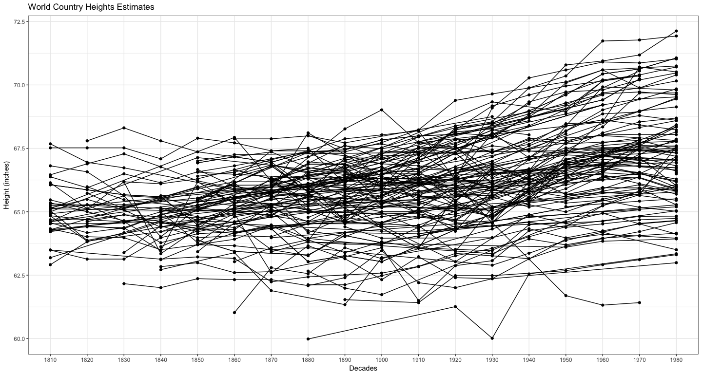
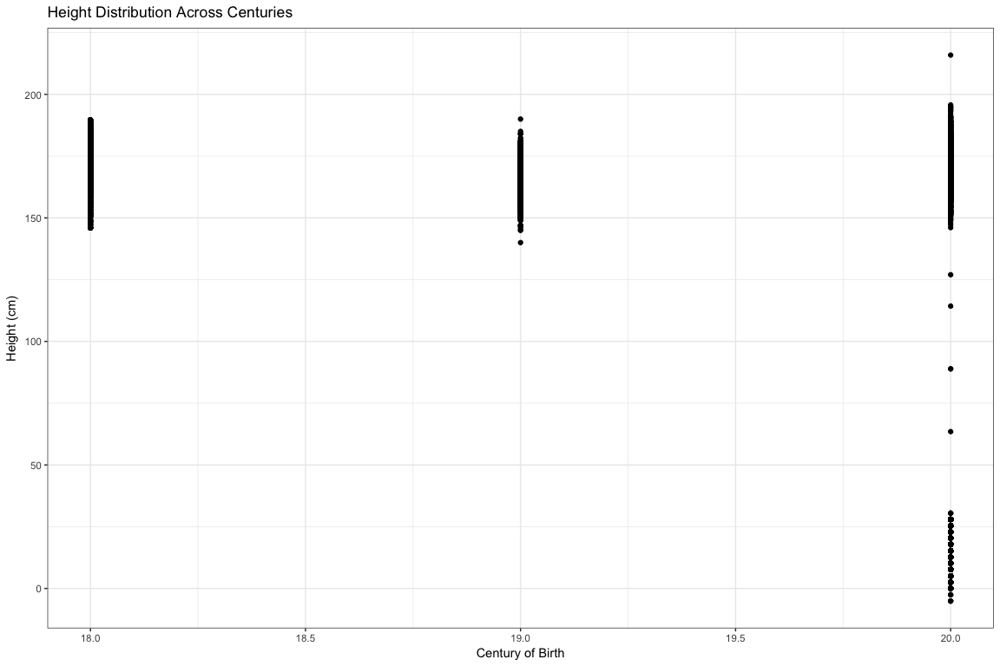
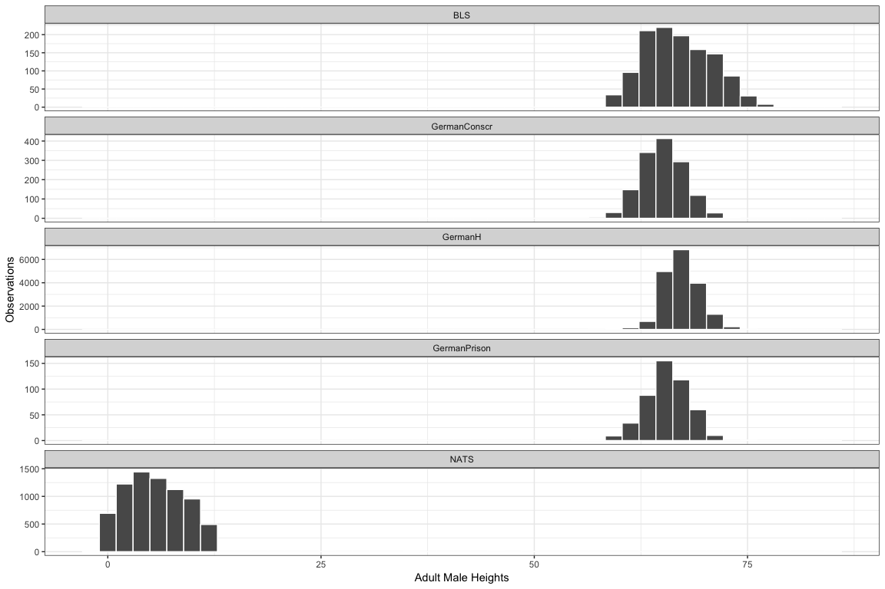

# Case Study 4: I can clean your data
Stacy Wilkerson  


```r
#Note: I spent about 9 hours on this Case Study
heightdatalong.xlsx <- read_xlsx("./heightdatalong.xlsx")
alldata.rds <- read_rds("./alldata.rds")
```

##World Country Plot


```r
#xlsx plot
germany <- 
  heightdatalong.xlsx %>%
  group_by(Country) %>%
  filter(Country == "Germany")

notgermany <- 
  heightdatalong.xlsx %>%
  group_by(Country) %>%
  filter(Country != "Germany")

ggplot() +
  #geom_line(data = notgermany, mapping = aes(x = year_decade, y = height, group = Country)) +
  geom_point(data = notgermany, mapping = aes(x = year_decade, y = height, group = Country)) +
   geom_line(data = germany, mapping = aes(x = year_decade, y = height, group = Country), color = "red") +
  geom_point(data = germany, mapping = aes(x = year_decade, y = height, group = Country), color = "red", size = 4) +
  theme_bw() +
  labs(x = "Decades", y = "Height (inches)", title = "World Country Height Estimates")
```

<!-- -->

##Height Distribution Plot


```r
#5 data sets plot
alldata.rds %>%
  ggplot(aes(y = height_cm, x = birth_century)) +
  geom_point() + 
  labs(x = "Century of Birth", y = "Height (cm)", title = "Height Distribution Across Centuries") +
  theme_bw()
```

<!-- -->

```r
alldata.rds %>% ggplot(aes(x=height_in)) + 
  geom_histogram(color = "white", bins = 45) + 
  facet_wrap(~study, scales = "free_y", ncol = 1) + 
  theme_bw() + labs(x = "Adult Male Heights", y = "Observations")
```

<!-- -->

```r
#ggsave("Case_Study_04_plot.png", height = 11, width = 6)

#alldata.rds %>% 
  #group_by(study) %>% 
  #summarise(below65 = round(sum(height_in < 65)/n(), 3)) %>%
  #kable()
```

Based on these graphics we can see the overall height distribution of males based on decades. It is interesting to note that in 1850 there was a dramatic decline in overall heights, which might be from the potato famine that happened around that time. Then from the next two plots we can see the distribution of this data based on century and then based on the different studies. 


