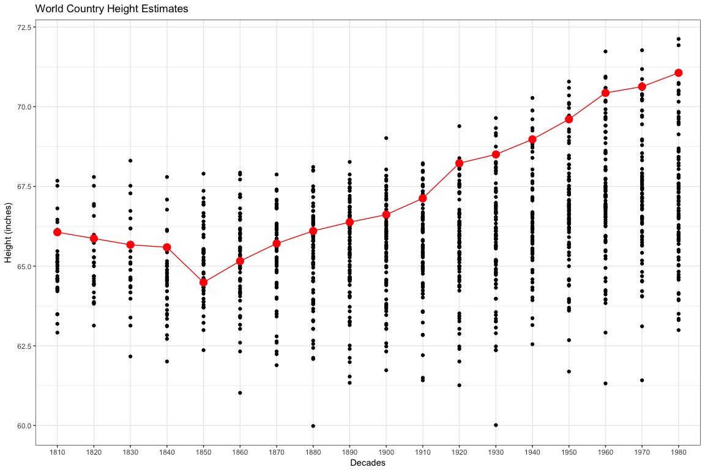

# Case Study 4: I can clean your data
Stacy Wilkerson  


```r
heightdatalong.xlsx <- read_xlsx("./heightdatalong.xlsx")
alldata.rds <- read_rds("./alldata.rds")
```

##PLots


```r
#xlsx plot
heightdatalong.xlsx %>%
  group_by(Country) %>%
  ggplot(aes(x = year_decade, y = height)) +
  geom_line(aes(group = Country)) +
  geom_point() +
  theme_bw() +
  labs(x = "Decades", y = "Height (inches)", title = "World Country Heights Estimates")
```

<!-- -->


```r
#5 data sets plot
alldata.rds %>%
  ggplot(aes(y = height_cm, x = birth_century)) +
  geom_point() + 
  labs(x = "Century of Births", y = "Height (cm)", title = "Height Distribution Across Centuries") +
  theme_bw()
```

<!-- -->


