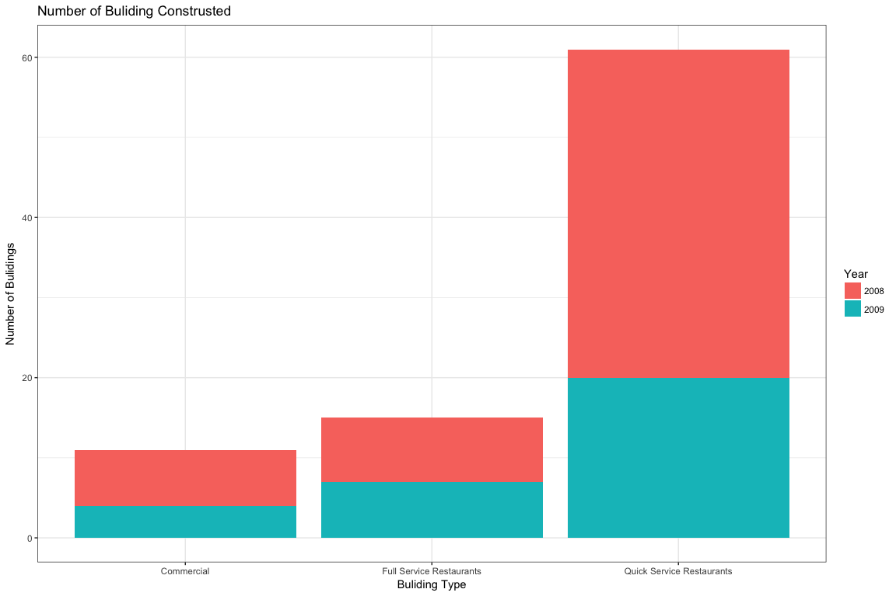
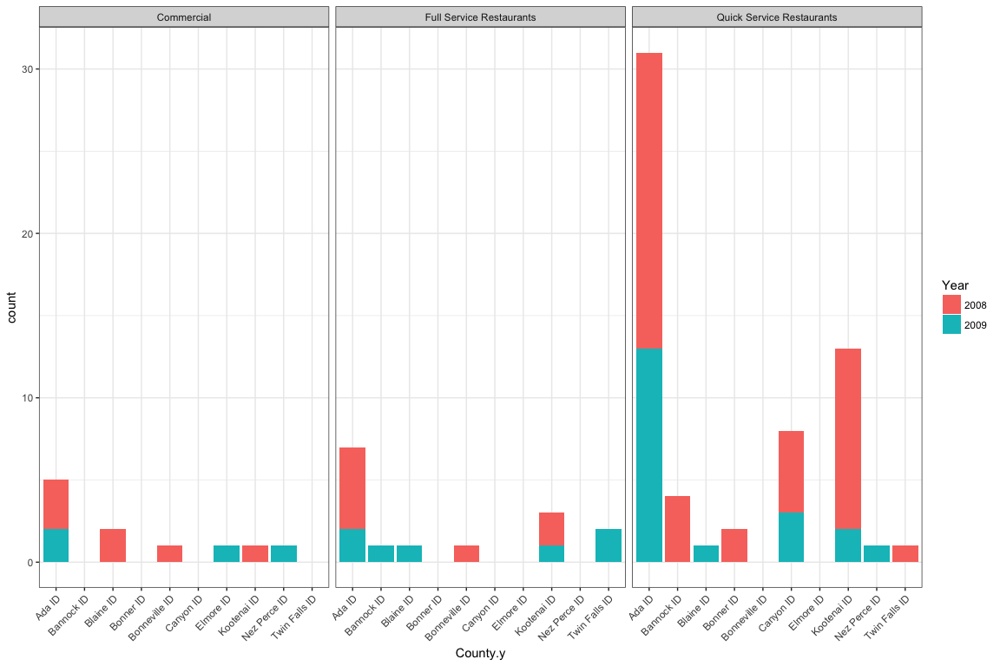

# Case Study 5: The collapse of construction in Idaho
Stacy Wilkerson  


```r
load("./restaurants.rda")
load("./permits.rda")
load("./climate_zone_fips.rda")
load("./buildings0809.rda")
```


```r
not_restaurants <- str_to_lower(c("development","Food preperation center", "Food Services center","bakery","Grocery","conceession","Cafeteria", "lunchroom","school","facility"," hall "))
standalone_retail <- str_to_lower(c("Wine","Spirits","Liquor","Convenience","drugstore","Flying J", "Rite Aid ","walgreens ","Love's Travel "))
full_service_type <- str_to_lower(c("Ristorante","mexican","pizza ","steakhouse"," grill ","buffet","tavern"," bar ","waffle","italian","steak house"))
quick_service_type <- str_to_lower(c("coffee"," java "," Donut ","Doughnut"," burger ","Ice Cream ","custard ","sandwich ","fast food "," bagel "))
quick_service_names <- str_to_lower(restaurants$Restaurant[restaurants$Type %in% c("coffee","Ice Cream","Fast Food")])
full_service_names <- str_to_lower(restaurants$Restaurant[restaurants$Type %in% c("Pizza","Casual Dining","Fast Casual")])
#joining data
joindata <- left_join(buildings0809, climate_zone_fips, by = c("FIPS.state", "FIPS.county"))
#sum(is.na(joindata))
#nrow(joindata)
```


```r
fooddata <- joindata %>%
  filter(Type == "Food_Beverage_Service") %>%
  mutate(
    spt = str_trim(str_to_lower(.$ProjectTitle)),
    build_type = case_when(
      str_detect( spt, paste( c( not_restaurants, standalone_retail, "retail", "club" ), collapse = "|" ) ) ~ "Commercial",
      str_detect( spt, paste( full_service_names, collapse = "|" ) ) ~ "Full Service Restaurants",
      str_detect( spt, paste( quick_service_names, collapse = "|" ) ) ~ "Quick Service Restaurants",
      !(str_detect(spt, paste(c( quick_service_names, full_service_names), collapse = "|"))) & (SqFt >= 4000) ~ "Full Service Restaurants",
      !(str_detect(spt, paste(c( quick_service_names, full_service_names), collapse = "|"))) & (SqFt < 4000) ~ "Quick Service Restaurants", TRUE  ~ "Unknown"))
```

###Questions

1. How did full-service restaurant construction compare to quick service restaurant construction across county and years?

2. How did restaurant construction fare compare to the other commercial construction in Idaho?

3. Which county in Idaho spent the most on fast food construction each year?

4. In that county how did other commercial construction compare?

###Graphics


```r
fooddata %>% 
  ggplot(aes(x = build_type, fill = Year)) + 
  geom_bar() +
  labs(x = "Buliding Type", y = "Number of Bulidings",title = "Number of Buliding Construsted") +
  theme_bw()
```

<!-- -->


```r
fooddata %>% 
  group_by(build_type, County.y, Year) %>% 
  ggplot(aes(x = County.y, fill = Year)) + 
  geom_bar() + 
  facet_wrap(~build_type) + 
  theme_bw() +
   theme(axis.text.x = element_text(angle = 45, hjust = 1))
```

<!-- -->

Based on the above graphic it looks like Quick service restaurants did better then full service restaurants. In 2008 and 2009 There was a significant amount of more restaurants constructed than commercial construction. Ada, ID probably spent the most money on on fast food restaurant construction. Ada, ID also built more and probably spent more on construction of full service restaurants and on commercial construction.   
