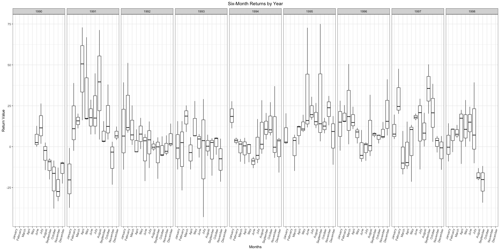

# Task 11: Controlling Categorical Variables (Factors)
Stacy Wilkerson  


```r
Dart.rds <- read_rds(gzcon(url("https://github.com/byuistats/data/raw/master/Dart_Expert_Dow_6month_anova/Dart_Expert_Dow_6month_anova.RDS")))

tidydata <- Dart.rds %>%
  separate(contest_period, into = c("start", "end"), sep = "-") %>% 
  separate(end, into = c("month_end", "year_end"), sep = -5) %>%
  group_by(month_end) %>%
  na.omit 
#saveRDS(tidydata, "tidydata.rds")
tidydata$month_end <- factor(tidydata$month_end, levels = month.name)
```


```r
tidydata %>% 
  na.omit %>%
  ggplot() +
  geom_boxplot(mapping = aes(x = month_end, y = value)) + 
  facet_grid(. ~ year_end) +
  labs(x = "Months", y = "Return Value", title = "Six-Month Returns by Year") + 
  theme_bw() +
  theme(axis.text.x = element_text(angle = 75, hjust = 1), plot.title = element_text(hjust = 0.5)) 
```

<!-- -->

The above graph shows every month of stock returns based on the eight different years. It is interesting to see that as the years go by the months in each of the different years either significantly increases or decreases. In every year there is no two similar months. This box plot fluctuates a lot as time goes by. 


