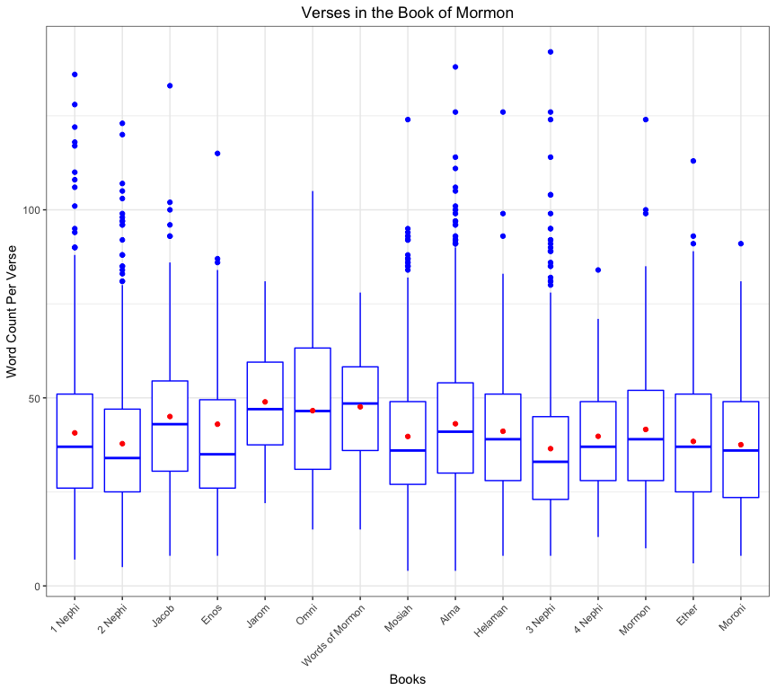

# Task 12: Counting Words and Occurrences
Stacy Wilkerson  


```r
ldsscr <- read_csv("./lds-scriptures.csv")
```


```r
scr_data <-
  ldsscr %>%
    mutate(word_count = stri_count_words( scripture_text ))
bom <- filter(scr_data, volume_title == "Book of Mormon" )
newtestament <- filter(scr_data, volume_title == "New Testament")
#Question 1
bommean <-
  scr_data %>%
  filter( volume_title == "Book of Mormon" ) %>%
  {mean(.$word_count)}
meannewtestament <-
  scr_data %>%
  filter( volume_title == "New Testament" ) %>%
  {mean( newtestament$word_count )}
# Question 2
bomJesus <-
  scr_data %>%
  filter(volume_title == "Book of Mormon") %>%
  {str_count(.$scripture_text, "\\W*((?i)jesus(?-i))\\w*" )} %>%
  sum()
newtestJesus <-
  scr_data %>%
  filter( volume_title == "New Testament" ) %>%
  {str_count( .$scripture_text, "\\W*((?i)jesus(?-i))\\w*" )} %>%
  sum()
#Question 3
bookorder <-
  c("1 Nephi","2 Nephi","Jacob","Enos","Jarom","Omni","Words of Mormon","Mosiah","Alma","Helaman","3 Nephi","4 Nephi","Mormon","Ether","Moroni")
bomBook <- scr_data %>%
  filter( volume_title == "Book of Mormon" ) %>%
  aggregate( word_count ~ book_title, ., mean)
```

###Question 1
What is the average verse (number of words) in the New Testament compared to the Book of Mormon?

| Book | Average Verse Length | 
|------|----------------------|
| Book of Mormon| 40.4986372| 
| New Testament | 22.6708559| 

###Question 2
How often is the word Jesus in the New Testament compared to the Book of Mormon?

| Book | Number of Times Jesus Occurs | 
|------|----------------------|
| Book of Mormon| 184| 
| New Testament | 984| 

###Question 3
How do the verses from each book in the Book of Mormon compare in average word length?


```r
ggplot() +
  geom_boxplot( data = bom, aes( x = factor( book_title, levels = bookorder ), y = word_count ), color = "blue" ) +
  geom_point( data = bomBook, aes( x = factor( book_title, levels = bookorder ), y = word_count ), color = "red" ) +
  labs(
    title = "Verses in the Book of Mormon",
    x = "Books",
    y = "Word Count Per Verse"
  ) +
  theme_bw() +
  theme( plot.title = element_text(hjust = 0.5), axis.text.x = element_text(angle = 45, hjust = 1) )
```

<!-- -->

```r
#ggsave( "ldsscr.png", device = "png", width = 9, height = 6)
```

Looking at question 1 the Book of Mormon has longer verses on average compared to the New Testament. Looking at question 2 the New Testament uses Jesus's name more. Now finanlly looking at question 3 for the box plot. We see the distributions of the word counts in each verse in the books of the Book of Mormon. The dots shows the mean of theses verses. On average it looks like Jarom has the longest verses overall. Mosiah looks like it has the one of the shortest verses and 3 Nephi has one of the longest verses.     

