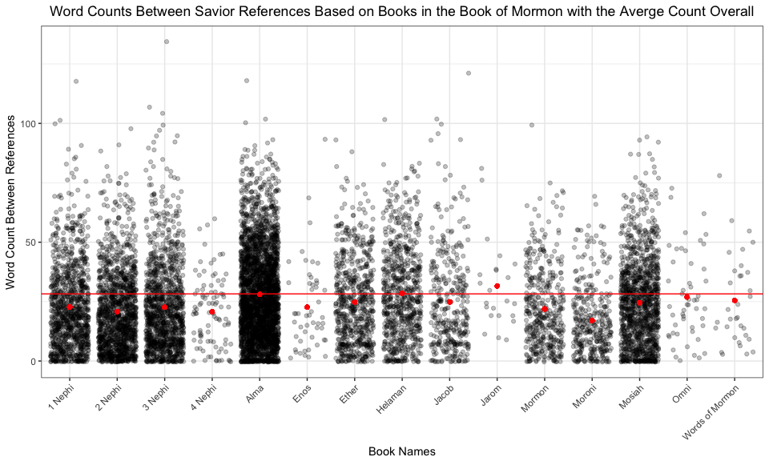

# Case Study 6: Counting Names in Scripture
Stacy Wilkerson  


```r
#Downloading and unzipping the scripture data
#download("http://scriptures.nephi.org/downloads/lds-scriptures.csv.zip", "M335_Tasks/Case_Study_06/analysis/scriptures.zip", mode = "wb")
#unzip("M335_Tasks/Case_Study_06/analysis/scriptures.zip", exdir = file.path(getwd(),"M335_Tasks/Case_Study_06/analysis"))
#file.remove("M335_Tasks/Case_Study_06/analysis/scriptures.zip")
#scriptures <- read_csv("M335_Tasks/Case_Study_06/analysis/lds-scriptures.csv")
scriptures <- read_csv("./lds-scriptures.csv")
#Names of the Savior
names <- read_rds(gzcon(url("https://byuistats.github.io/M335/data/BoM_SaviorNames.rds")))
```


```r
bom <- scriptures %>% filter(volume_short_title == "BoM")
JesusNames <- paste(names$name, collapse = "|")
bomname <- str_replace(bom$scripture_text, JesusNames, "#1")
bomnames <- as.data.frame(bomname)

namessplit <- str_split(bomname, "#1")
countnames <- stri_count_words(unlist(namessplit))
countnamesdata <- as.data.frame(countnames) 
countnamesdata <- countnamesdata %>%
  mutate(., meanofnames = mean(countnames))

# filters to only the BoM in the scriptures data, replaces the scripture_text column with every verse split on a refference to Jesus, then for every split string in scripture_text column it creates a new row, and then we count the number of words in each scripture_text cell.
meaningful_data <-
  scriptures %>%
  filter( volume_title == "Book of Mormon" ) %>%
  {
    mutate(., scripture_text = str_split( .$scripture_text, paste( names$name, collapse = "|" ) )
    )
  } %>%
  unnest( scripture_text ) %>%
  {mutate(., count = stri_count_words( .$scripture_text )
  )}

meaningful_data2 <- 
  meaningful_data %>%
  group_by(book_title) %>%
  mutate(meanofbooks = mean(count))
```


###Plot


```r
ggplot() +
  geom_jitter(data = meaningful_data, mapping = aes(x = book_title, y = count), color = "black", alpha = 0.25) +
  geom_hline(yintercept = 28.25118, color = "red") +
  geom_point(data = meaningful_data2, mapping = aes(y = meanofbooks, x = book_title), color = "red") +
  theme_bw() +
  theme(plot.title = element_text(hjust = 0.5), axis.text.x = element_text(angle = 45, hjust = 1)) +
  labs(y = "Word Count Between References", x = "Book Names", title = "Word Counts Between Savior References Based on Books in the Book of Mormon with the Averge Count Overall") +
  scale_y_continuous()
```

<!-- -->

This graphic shows the counts between Savior references based on books in the Book of Mormon with the average count overall (28.25) signified as the red horizontal line. We can see the distribution of the lengths between references based on the different books and it looks like 4 Nephi has most of the smallest lengths between references. 3 Nephi looks to have one of the longest word counts between reference.   


