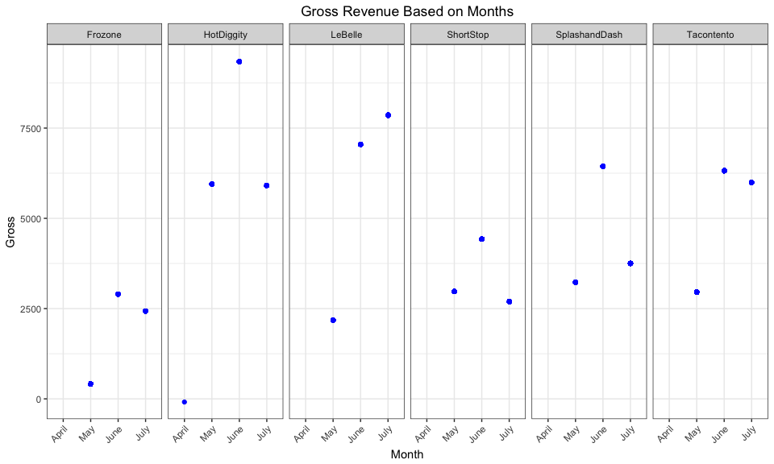
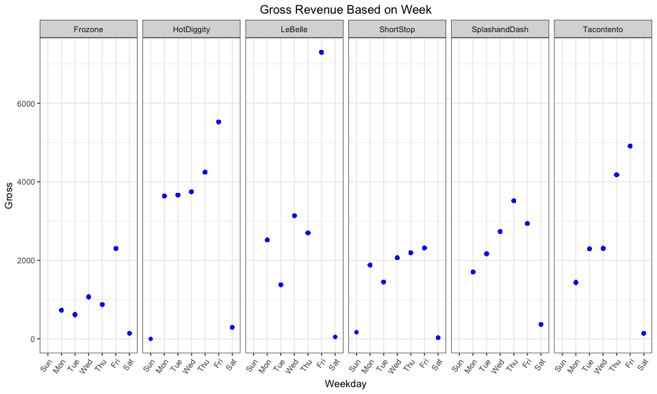
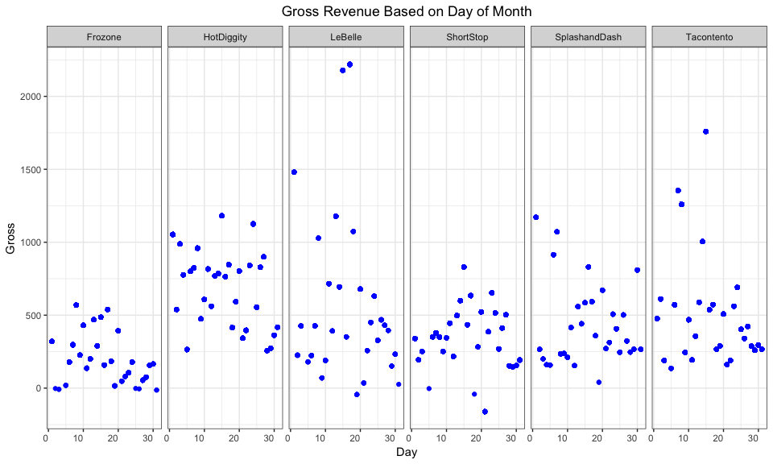
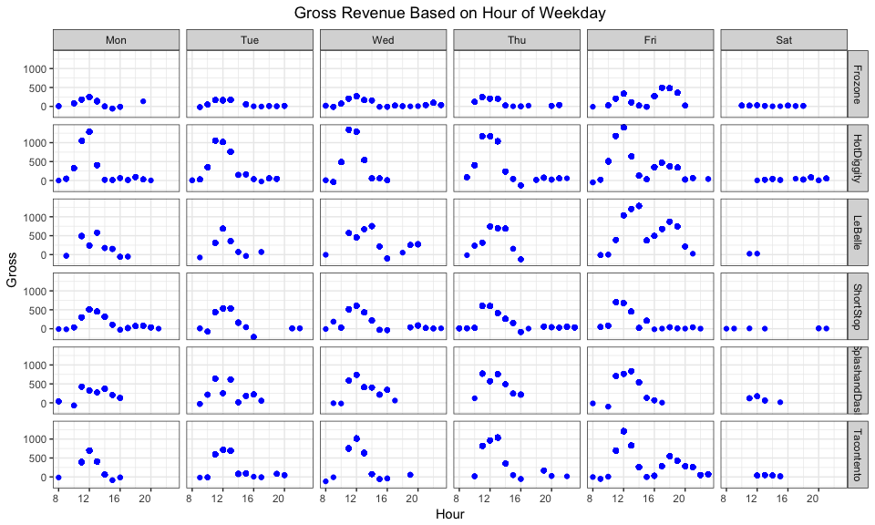

# Case Study 7: It's about time
Stacy Wilkerson  


##Background

We have transaction data for a few businesses that have been in operation for three months (April 20, 2017 to July 20, 2017). Each of these business are seeking an investment loan to expand their businesses. We we look at daily, weekly, and monthly gross revenue summaries and comparisons. 


```r
#IBC <- read_csv("https://byuistats.github.io/M335/data/sales.csv")
#write_csv(IBC, path = "./IBC_sales.csv")
IBC <- read_csv("./IBC_sales.csv")

IBC <- IBC %>%
  mutate(MTZ = with_tz(.$Time, tzone = "America/Denver")) %>%
  filter(Name != "Missing") %>% #removed 2 missing names
  {mutate(., Month = month(.$MTZ, label = TRUE, abbr = FALSE), Day = day(.$MTZ), Hour = hour(.$MTZ), Weekday = wday(.$MTZ, label = TRUE))}
```

##Monthly Gross


```r
IBCmonth <- IBC %>%
  group_by(Month, Name) %>%
  mutate(Gross = sum(Amount))
ggplot() +
  geom_point(data = IBCmonth, mapping = aes(x = Month, y = Gross)) +
  facet_grid(.~Name) + 
  theme_bw() +
  theme(plot.title = element_text(hjust = 0.5), axis.text.x = element_text(angle = 45, hjust = 1)) +
  labs(title = "Gross Revenue Based on Months")
```

<!-- -->

```r
pander(favstats(Gross~Name, data = IBCmonth)[1:9])
```


---------------------------------------------------------------
    Name       min    Q1   median   Q3   max   mean   sd    n  
------------- ------ ---- -------- ---- ----- ------ ----- ----
   Frozone    415.2  2427   2898   2898 2898   2468  720.4 1674

 HotDiggity   -87.67 5951   5951   9343 9343   7512  1702  5887

   LeBelle     2183  7048   7048   7858 7858   6681  1869  634 

  ShortStop    2692  2692   2979   4429 4429   3530  802.4 2593

SplashandDash  3232  3232   3752   6444 6444   4897  1494  533 

 Tacontento    2953  5992   6319   6319 6319   5436  1392  4333
---------------------------------------------------------------


```r
#Idea for Month (doesn't work)
IBCdata <- IBC %>%
  group_by(Month, Name) %>%
  mutate(Gross = sum(Amount))
ggplot() +
  geom_area(data = IBCmonth, mapping = aes(x = Month, y = Gross, fill = Name), stat = "identity", position = "stacked") 
```

##Weekly Gross


```r
IBCweek <- IBC %>%
  group_by(Weekday, Name) %>%
  mutate(Gross = sum(Amount))
ggplot() +
  geom_point(data = IBCweek, mapping = aes(x = Weekday, y = Gross)) +
  facet_grid(.~Name) + 
  theme_bw() +
  theme(plot.title = element_text(hjust = 0.5), axis.text.x = element_text(angle = 55, hjust = 1)) +
  labs(title = "Gross Revenue Based on Week")
```

<!-- -->

```r
pander(favstats(Gross~Name, data = IBCweek)[1:9])
```


---------------------------------------------------------------
    Name       min   Q1    median   Q3   max   mean   sd    n  
------------- ----- ----- -------- ---- ----- ------ ----- ----
   Frozone    143.8 729.5   1069   2305 2305   1445  745.7 1674

 HotDiggity   0.05  3663    3750   5527 5527   4250   873  5887

   LeBelle    49.5  2697    3139   7303 7303   4591  2368  634 

  ShortStop    30   1876    2065   2195 2315   2008  313.1 2593

SplashandDash  369  2168    2733   2939 3518   2580  722.4 533 

 Tacontento   142.8 2294    4179   4906 4906   3387  1330  4333
---------------------------------------------------------------

##Daily Gross


```r
IBCday <- IBC %>%
  group_by(Day, Name) %>%
  mutate(Gross = sum(Amount))
ggplot() +
  geom_point(data = IBCday, mapping = aes(x = Day, y = Gross)) +
  facet_grid(.~Name) + 
  theme_bw() +
  theme(plot.title = element_text(hjust = 0.5), axis.text.x = element_text(angle = 0, hjust = 1)) +
  labs(title = "Gross Revenue Based on Day of Month")
```

<!-- -->

```r
pander(favstats(Gross~Name, data = IBCday)[1:9])
```


-----------------------------------------------------------------
    Name       min    Q1    median   Q3    max   mean   sd    n  
------------- ------ ----- -------- ----- ----- ------ ----- ----
   Frozone    -13.33 178.7  321.4   485.3 568.7 342.8  166.9 1674

 HotDiggity   257.2  592.7  801.6   959.5 1182  774.8  237.1 5887

   LeBelle    -43.98 426.6  715.5   2179  2219   1067  767.8 634 

  ShortStop   -161.3 338.7  432.9   522.5 830.5 440.5  187.4 2593

SplashandDash   40   271.4  506.8    809  1170  558.9  306.7 533 

 Tacontento   134.8  356.5  561.6   689.9 1760  675.1  448.1 4333
-----------------------------------------------------------------

##Hours of Operation (Foot Traffic)


```r
IBChour <- IBC %>%
  filter(Amount < 250, Hour > 7, Weekday != "Sun") %>%
  group_by(Hour, Name, Weekday) %>%
  mutate(Gross = sum(Amount)) 
ggplot() +
  geom_point(data = IBChour, mapping = aes(x = Hour, y = Gross)) +
  facet_grid(Name~Weekday) + 
  theme_bw() +
  theme(plot.title = element_text(hjust = 0.5), axis.text.x = element_text(angle = 0, hjust = 1)) +
  labs(title = "Gross Revenue Based on Hour of Weekday")
```

<!-- -->

```r
pander(favstats(Gross~Name, data = IBChour)[1:9])
```


-----------------------------------------------------------------
    Name       min    Q1    median   Q3    max   mean   sd    n  
------------- ------ ----- -------- ----- ----- ------ ----- ----
   Frozone    -55.96 163.2  207.9   334.9  491  236.5  139.1 1674

 HotDiggity   -127.8 485.4   1048   1283  1400  893.1  417.1 5884

   LeBelle    -124.5 354.6  677.4   753.4 1286  616.6  353.7 633 

  ShortStop   -219.7 409.8  510.3   600.5  703  447.9  202.3 2585

SplashandDash  -100   221    426    707.5 834.5 451.9   254  532 

 Tacontento   -117.5 549.2  714.8   961.4 1208  709.4  306.3 4330
-----------------------------------------------------------------

##Recommendation

The best recomendation to give an invest ment loan to would be Hotdiggity or LeBelle.  
