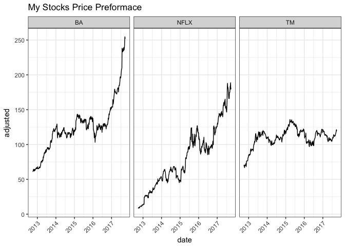
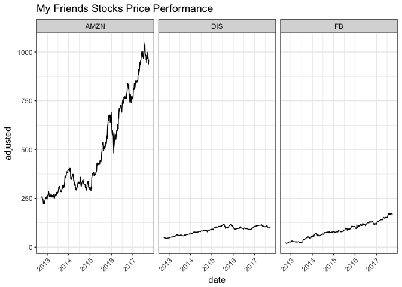
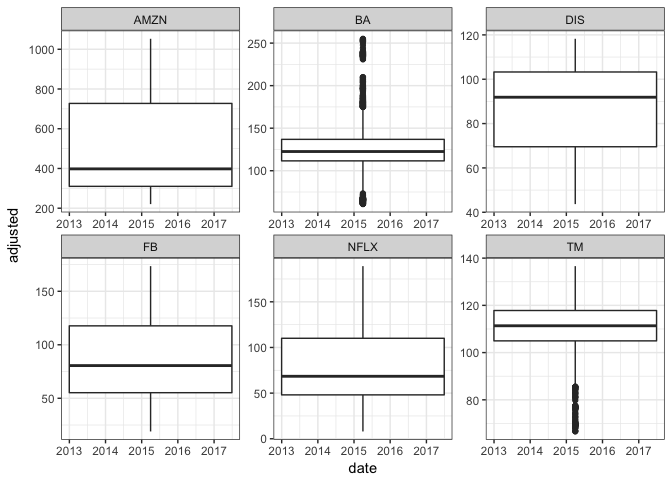

# Task 15: My investment is better than yours
Stacy Wilkerson  


```r
#For this task I used code from Josh Bowers.
my_tickers <- c( "TM", "NFLX", "BA" )
friend_tickers <- c( "AMZN", "DIS", "FB" )

prices <-
  tq_get(
    c( my_tickers, friend_tickers ),
    get = "stock.prices",
    complete_cases = TRUE,
    from = "2012-10-01",
    to = "2017-10-01"
  )

me <-
  prices %>%
  filter(symbol == my_tickers)


friend <-
  prices %>%
  filter(symbol == friend_tickers )


me %>%
  ggplot( aes( x = date, y = adjusted ) ) +
  geom_line() +
  facet_wrap( ~ symbol ) +
  theme_bw() +
  theme( axis.text.x = element_text(angle = 45, hjust = 1) )
```

<!-- -->

```r
friend %>%
  ggplot( aes( x = date, y = adjusted ) ) +
  geom_line() +
  facet_wrap( ~ symbol ) +
  theme_bw() +
  theme( axis.text.x = element_text(angle = 45, hjust = 1) )
```

<!-- -->

```r
prices %>%
  group_by(symbol) %>%
  ggplot( aes( x = date, y = adjusted ) ) +
  geom_boxplot() +
  facet_wrap( ~ symbol, scales="free" ) +
  theme_bw()
```

```
## Warning: Continuous x aesthetic -- did you forget aes(group=...)?
```

<!-- -->


