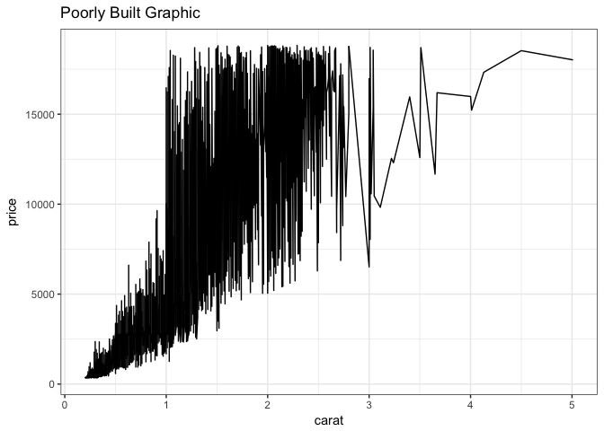
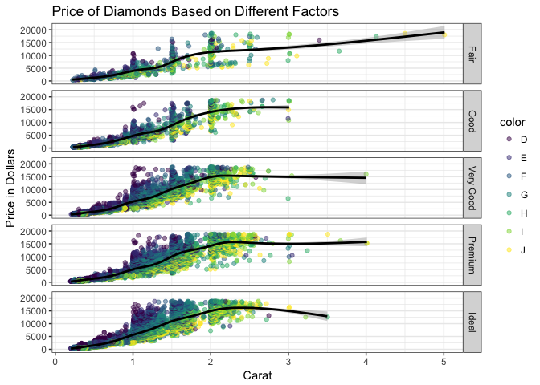

# Task 18: Making Bad Graphics
Stacy Wilkerson  


##Background

 Your brother is about to go out and buy a diamond ring for his fiancee and needs some advice on what type of diamond to purchase. He knows that karat has a strong relationship with price. He wants to know what other elements of the diamond he could sacrifice to maximize the karat size for a budget around $2,000.

##Graphics


```r
#Poorly Built Graphic
diamonds %>%
  ggplot() +
  geom_line(mapping = aes(x = carat, y = price)) +
  theme_bw() +
  labs(title = "Poorly Built Graphic")
```

<!-- -->


```r
#A Better Built Graphic
diamonds %>%
  group_by(cut, price) %>%
  #mutate(pricemean = mean(price)) %>%
  ggplot(aes(x = carat, y = price)) +
  #geom_smooth(aes(x = carat, y = price), color = "black") +
  geom_jitter(mapping = aes(color = color), alpha = 0.5) +
  geom_smooth(aes(x = carat, y = price), color = "black") +
  #geom_line(aes(x = carat, y = pricemean)) +
  facet_grid(cut~.) +
  theme_bw() +
  labs(y = "Price in Dollars", x = "Carat", title = "Price of Diamonds Based on Different Factors")
```

<!-- -->

The first graphic is accurate, but it is hard to read. The second graphic shows us the price of diamonds based on carat, cut, and color. The line just shows the avaerage price and the error based on carat and cut. Based on the second graphic it looks like the worst color (D) is cheaper no matter the cut. The price also increases the clager the carat.  


