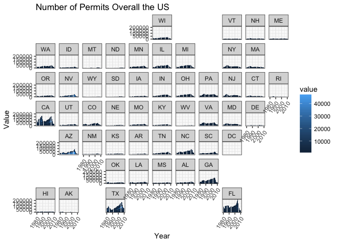
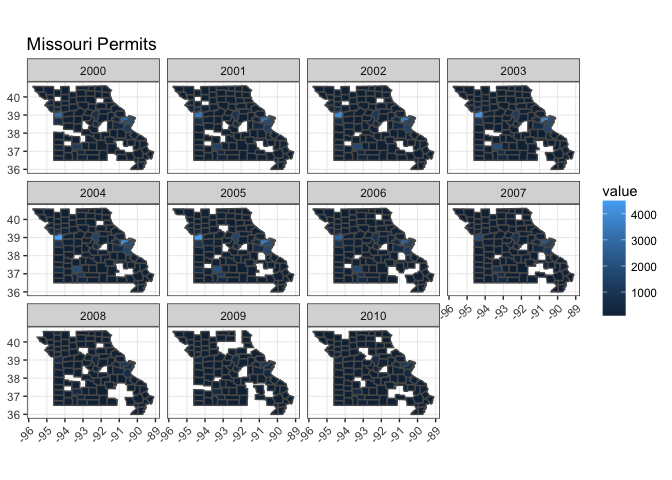

# Case Study 10: Building the past
Stacy Wilkerson  


##Background 

You have been asked to support a story for the local paper (that has a web presence) that looks back on the housing collapse and the early effects of residential construction. You have data on residential building permits from 1980 through 2010 for each county in the United States. Your colleague that is writing the article would like a few maps and graphics that highlight the single family building permit patterns across your state as well as the patterns in the US.

Remember the big story is the collapse of new building permits at the initial stages of the mortgage crisis. Make sure your graphics highlight the collapse in a clear and honest manner.

##Graphics


```r
states <- us_states(resolution = "high")
counties <- us_counties()
permitdata <-
  full_join(permits, counties, by = c("countyname" = "countyfp"))
singlefamily <- permitdata %>%
  filter(variable == "Single Family")

#Single family building permits
singlefamily %>%
  ggplot(aes(x = year, y = value, fill = value)) +
  geom_col() +
   facet_geo(~ StateAbbr) +
  theme_bw() +
  theme(axis.text.x = element_text(angle = 55, hjust = 1)) +
  labs(x = "Year", y = "Value", title = "Number of Permits Overall the US")
```

<!-- -->


```r
#I am from Missouri!

singlefamily <-
  permits %>%
  filter( variable == "Single Family", StateAbbr == "MO" ) %>%
  mutate(
    county = str_replace(.$countyname, " County", ""))
counties <-
  us_counties(state = "Missouri") %>%
  select( name, countyfp, aland, awater, geometry )
MOsinglefam <- left_join( singlefamily, counties, by = c("county" = "name"))

MOsinglefam %>%
  filter(year >= 2000) %>%
  ggplot() +
    geom_sf(aes(fill = value)) +
    scale_fill_viridis("value") +
    theme_bw() +
    facet_wrap(~year) +
    theme(axis.text.x = element_text(angle = 45, hjust = 1)) +
    labs(title = "Missouri Permits")
```

<!-- -->


